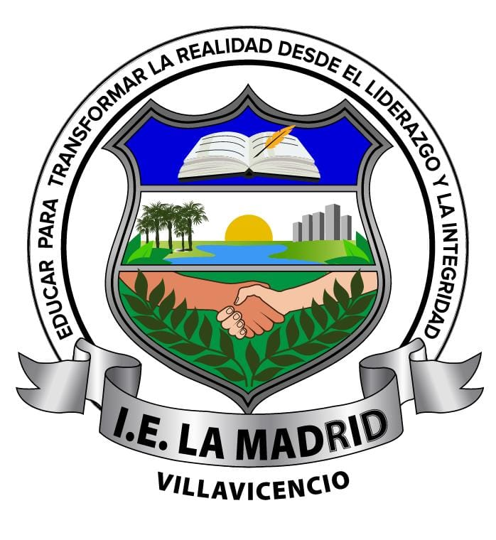
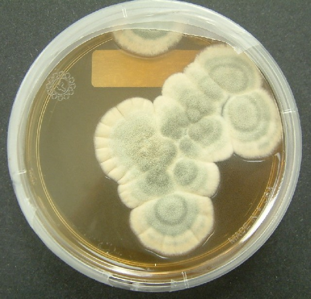
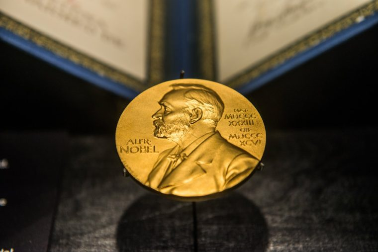
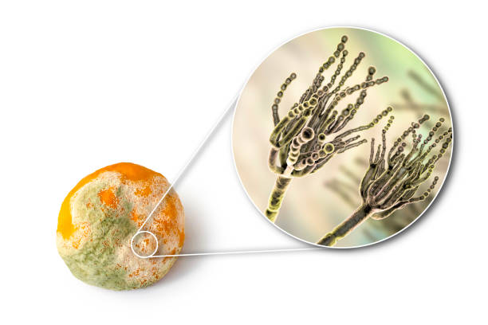
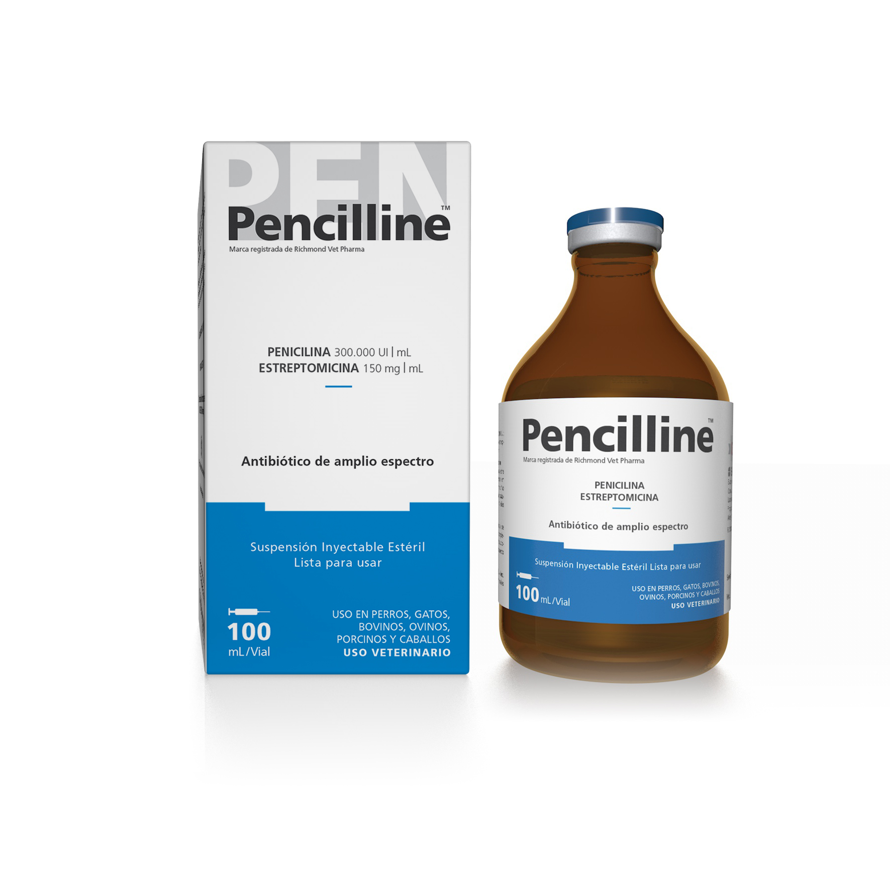

<html>
<head>
    <title>PENICILLIUM</title>
    
</head>
<body>
    
    <header>
        <h1><a id="enlace" href="https://es.wikipedia.org/wiki/Penicillium_chrysogenum" style="width: 1000px; display: block; margin: 0 auto; margin-right: 1000px;">Penicillium - Penicillium chrysogenum</a></h1>
          
    </header>
    <h2>Reino Fungi</h2>
    <h3>Los Penicillium son considerados hongos, por eso están en el reino Fungi.</h3>
    <h1>IMPORTANCIA</h1>
    <h2>Penicillium chrysogenum, antes conocido como Penicillium notatum, es el hongo que proporcionó un rendimiento óptimo para el efecto antibiótico en el género Penicillium.  En 1928, el científico británico Alexander Fleming descubrió su potencial, pero fue en 1942 cuando los científicos Florey y Chain lograron aislarlo y llevarlo a la producción industrial. Por este logro, los tres investigadores recibieron el Premio Nobel de Medicina en 1945. 
    Antes del descubrimiento de Fleming, ya había evidencia de investigaciones sobre el uso de hongos Penicillium para tratar infecciones bacterianas. Por ejemplo, en 1897, el médico francés Ernest Duchesne presentó una tesis sobre el antagonismo entre mohos y microbios, y en 1923, el científico costarricense Clodomiro Picado también estudió el efecto fitopatógeno de los hongos. 
    La penicilina revolucionó la medicina al tratar enfermedades antes consideradas incurables. Durante la Segunda Guerra Mundial, su valor terapéutico se volvió evidente, y su uso se expandió enormemente. Aunque la cepa inicial producía poca penicilina, se descubrió que otras especies, como Penicillium chrysogenum, eran mejores productoras. La mejora de técnicas de fermentación permitió producir hasta 60 g/L de penicilina en la actualidad. Este descubrimiento transformó el tratamiento médico y allanó el camino para el desarrollo de otros antibióticos. </h2>
    <h1>En Colombia</h1>
    <h2>En el contexto colombiano, el estudio de Penicillium chrysogenum ha sido significativo debido a su capacidad para sintetizar penicilina, un hito que revolucionó la medicina al introducir el primer antibiótico. La importancia de este hongo radica en su papel esencial en el tratamiento de infecciones bacterianas, que previamente podrían haber sido mortales. Su descubrimiento cambió el paradigma médico y salvó innumerables vidas.
    En Colombia, como en otras partes del mundo, el interés se ha centrado en entender los procesos biológicos y genéticos que permiten la producción de penicilina. La atención ha sido dirigida hacia la mejora de los métodos de producción industrial de este antibiótico vital. La industria farmacéutica y los científicos han estado investigando cómo optimizar los procesos de fermentación y cultivar cepas más eficientes de Penicillium chrysogenum para aumentar la producción de penicilina de manera rentable y sostenible.
    La investigación en Colombia también puede haber explorado aspectos relacionados con la biodiversidad de Penicillium chrysogenum y su presencia en diferentes entornos. Además de su uso en la producción de penicilina, los científicos pueden haber investigado su papel en la ecología microbiana y su interacción con otros organismos en los ecosistemas locales.
    En resumen, Penicillium chrysogenum ha sido objeto de estudio en Colombia debido a su contribución crucial a a la medicina y la industria farmacéutica. El hongo ha recibido atención por su potencial para mejorar la producción de antibióticos y su relevancia en la biotecnología.</h2>
    <h3><a id="enlace" href="https://chat.openai.com/">Fuente</a></h3>
</body>
</html>
