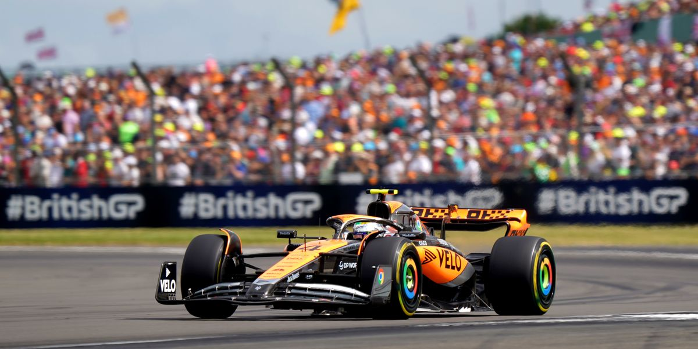

<!DOCTYPE html>
<html>
    <head>
        <title>web numero dos</title>
        
    </head>
    <body>
        <h1>FORMULA 1</h1>
        <h2>El mejor deporte del mundo </style> </h2>
        
McLaren second best team
        

    </body>
</html>
