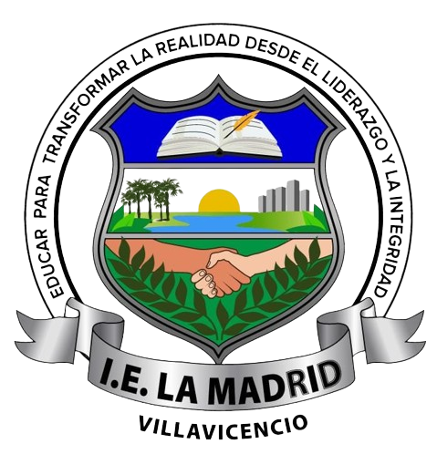
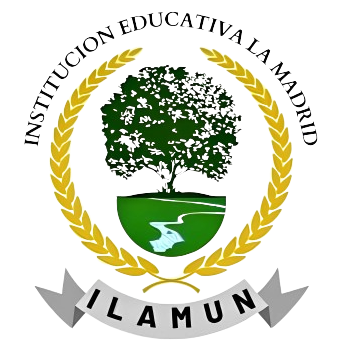

<html lang="es">
    <head>
    <meta charset="UTF-8">
    <meta name="viewport" content="width=device-width, initial-scale=1.0">
    
    </head>
<body>
    
    
    
    

        
    

     
     
     
     
    <h1 class="large-space">
¿ Que es ILAMUN ?
</h1>
    <h4 style="text-align: center;">Es el modelo de las naciones unidas ILAMUN de la Institución Educativa La Madrid. Se creo en el año 2022 que fue tambien el primer año de nuestra institucion en modalidad presencial, el proyecto se creo con el fin de generar espacios y ambientes en los cuales se puedan debatir temas globales llegando a un común acuerdo entre si, de este modo, formar líderes del mañana.</h4>
</body>
</html>
